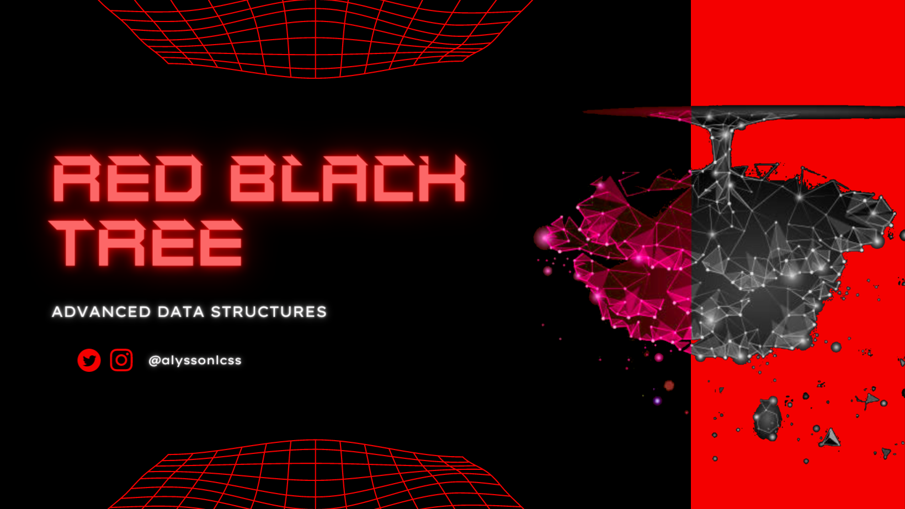

# Red Black-Tree
## 3-Work of the university - Advanced Data Structures
- Discipline - Advanced Data Structures
- Student: Alysson Pinheiro.
- Federal University of Ceara - Campus Russas.

### Description
Work in the Advanced Data Structures discipline.

The work consists:
[Access](https://github.com/alyssonlcss/EDA-Trabalho3.pdf)

## Questions and files

| 1. AVL - Implementations  | 
| -------------------       | 
|    1. Exercise [ok]       |  
|    2. Exercise [ok]       |  
|    3. Exercise [ok]       |  

| 2. Tests            | 
| ------------------- | 
|    1. Test [ok]     |  
|    2. Test [ok]     |  
|    3. Test [ok]     |  
|    4. Test [ok]     |  
|    5. Test [ok]     |  

| 1. Presentation       | Access link     |
| -------------------   | ------------------- |
|    Video   | [Access](https://youtu.be/pvBw1uotJHk) |  

## Author
Alysson Pinheiro.

## Language

C

## License

MIT